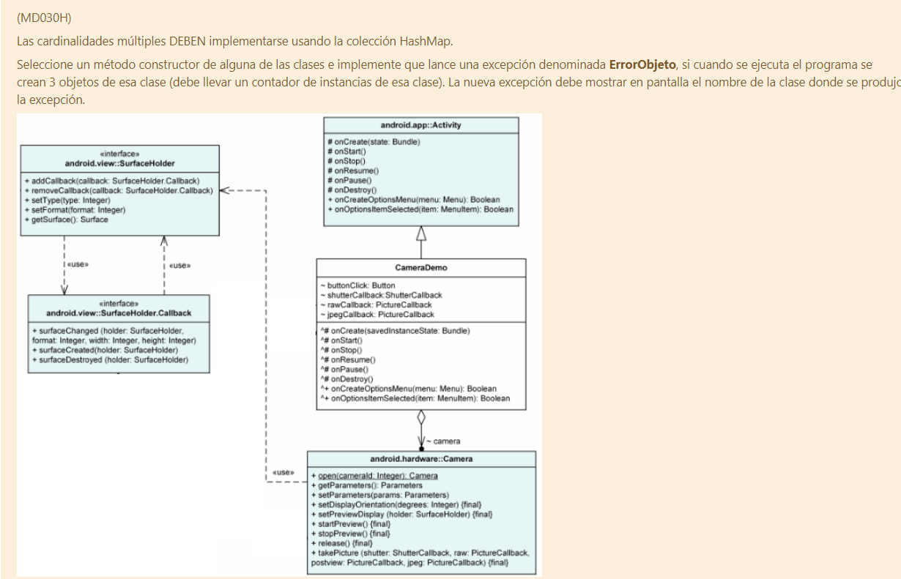

## hokkaido 

(MD030H)

[Español](./README_ES.md)

#### What the fuck is this?

This is (most of) the final project from the "Programming Paradigms" coursework from Universidad Tecnologica Nacional - FRM

#### Why hokkaido tho?

Because I like Japan and this is easy to search between my files.

#### You still haven't explained what is this supposed to be.

In simple terms, you are given the following exercise (note: this may be different whenever it's your turn):

The gist of it is: You should implement the following class diagram and make something that runs out of it, you need to use the HashMap class, you also need to implement a Throwable class called ErrorObjeto, which throws whenever you create 3+ instances of whatever class of your choice.