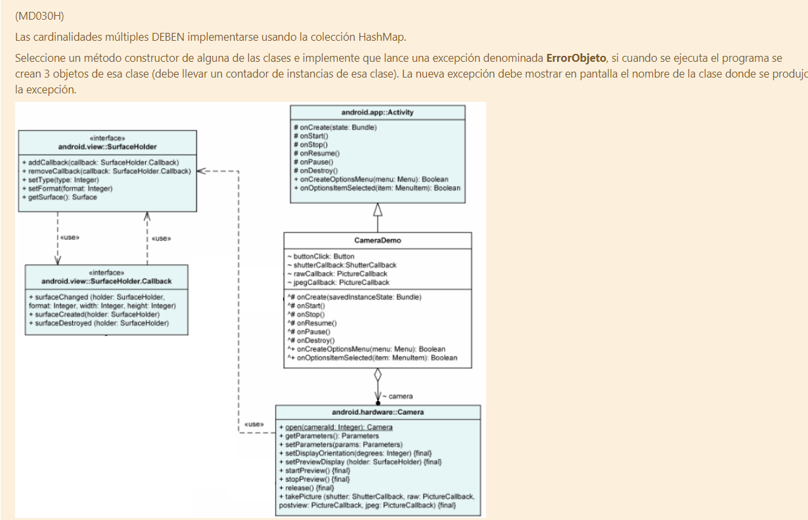

## hokkaido 

(MD030H)

[English](./README.md)

#### Que carajo es esto?

Esto es (la mayoria de) el proyecto final de la asignatura "Paradigmas de Programacion" de la Universidad Tecnologica Nacional - FRM

#### Por qué hokkaido?

Porque me gusta Japon y este nombre es facil de buscar entre mis archivos.

#### Todavia no has explicado que se supone que es esto.

En simples terminos, te dan el siguiente ejercicio (nota: esto puede ser differente cuando sea tu turno):

En resumen: Debes implementar el siguiente diagrama de clases y hacer algo que funcione a partir del mismo, tenes que usar la clase HashMap, y tambien tenes que implementar una clase a partir de Throwable de nombre ErrorObjeto, que tire un error cuando mas de 3 instancias de cualquier clase que elijas sean creadas.